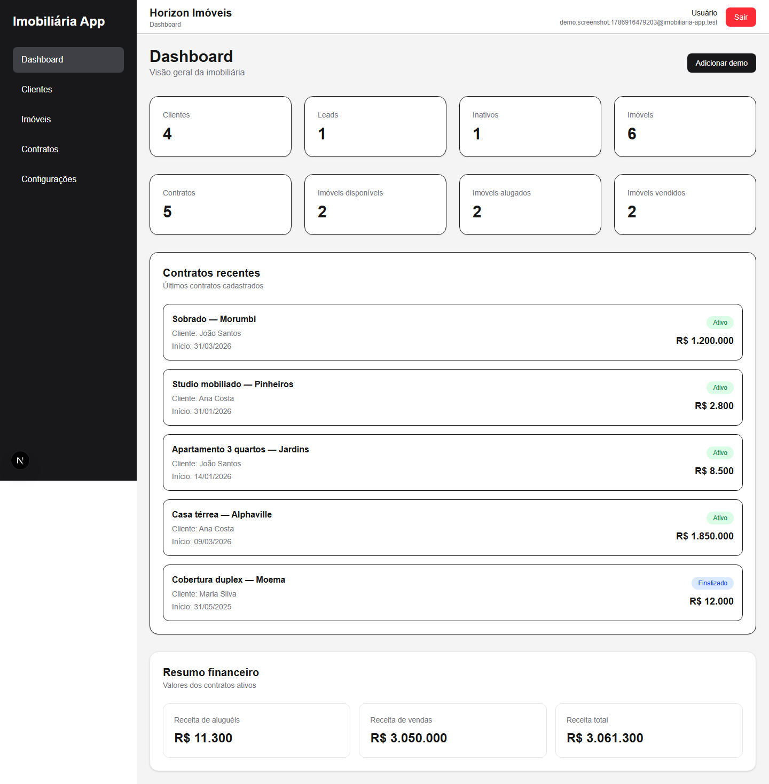
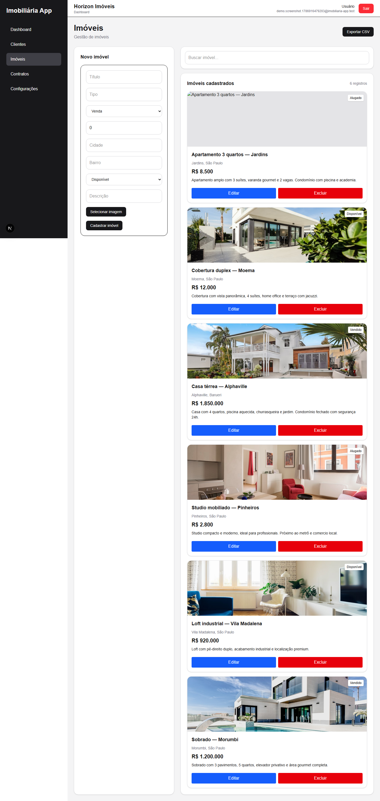
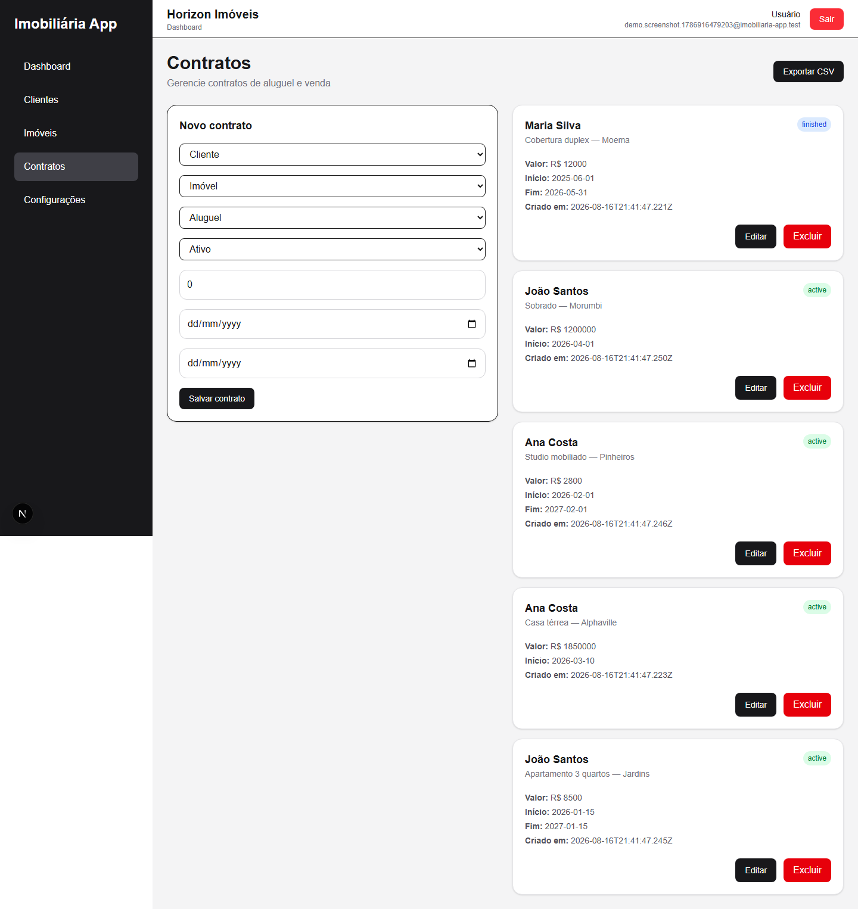
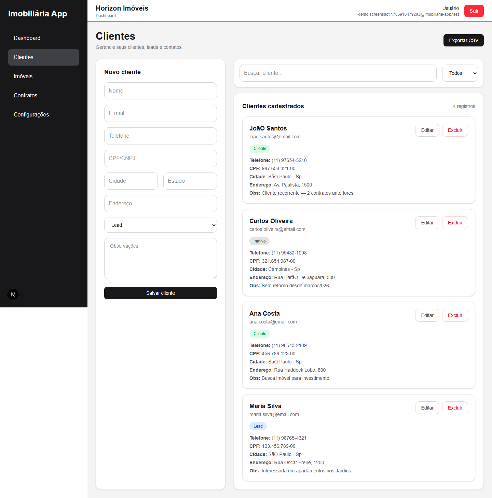

# 🏠 Imobiliária App

CRM imobiliário profissional — clientes, imóveis, contratos, dashboard em tempo real e regras de negócio automatizadas. Next.js + Firebase, em produção na Vercel.

## 🔗 Links

| | |
|---|---|
| **Demo ao vivo** | [imobiliaria-app-mu.vercel.app](https://imobiliaria-app-mu.vercel.app/) |
| **Case study** | [/case-study](https://imobiliaria-app-mu.vercel.app/case-study) |
| **Guia técnico** | [docs/GUIA_TECNICO.md](./docs/GUIA_TECNICO.md) |

## 🚀 Explorar a demo em 1 minuto

1. Acesse a [demo](https://imobiliaria-app-mu.vercel.app/register) e **crie uma conta**
2. No dashboard, clique em **"Popular com dados demo"**
3. Navegue por clientes, imóveis (com fotos reais), contratos e resumo financeiro

## 📸 Screenshots

> Execute `npm run screenshots` com o app rodando (veja [Guia Técnico](./docs/GUIA_TECNICO.md#10-scripts-úteis)).






## ✨ Destaques

- **Multi-tenant** — cada usuário vê apenas seus dados (`ownerId` + Firestore Rules)
- **Regras de negócio** — contratos sincronizam status do imóvel em transações atômicas
- **Tempo real** — React Query + listeners Firestore no dashboard
- **Dados demo** — clientes, imóveis com fotos Unsplash, contratos e financeiro
- **Exportação CSV** — clientes, imóveis e contratos
- **Paginação** — listagens escaláveis
- **Testes + CI** — Vitest + GitHub Actions

## 🛠️ Stack

`Next.js 16` · `React 19` · `TypeScript` · `Firebase` · `TanStack Query` · `Tailwind CSS` · `Zod` · `Vitest` · `Vercel`

## 📐 Arquitetura

```
Página → Hooks (React Query) → Repository → Firestore
```

Detalhes completos, trade-offs e roteiro para entrevistas: **[docs/GUIA_TECNICO.md](./docs/GUIA_TECNICO.md)**

## 🏃 Rodar localmente

```bash
npm install
cp .env.example .env.local   # preencha com credenciais Firebase
npm run dev
```

```bash
npm run build    # build produção
npm test         # testes unitários
npm run lint     # ESLint
```

### Firebase Rules

```bash
firebase deploy --only firestore:rules,storage
```

## 📄 Licença

Projeto pessoal — portfólio e estudo.
